# Pixy

A little robot that sits on your desktop and keeps an eye on your work.

Pixy answers Claude Code's permission prompts, chats with a language model
running on your own machine, remembers what you talked about last week, and tells
you when the build breaks or mail arrives. Then it goes quiet until it has
something to say.

**Everything runs on your machine.** No account, no telemetry, no server of ours
— there isn't one. Your chats, notes and search index never leave the disk they
were written to.

  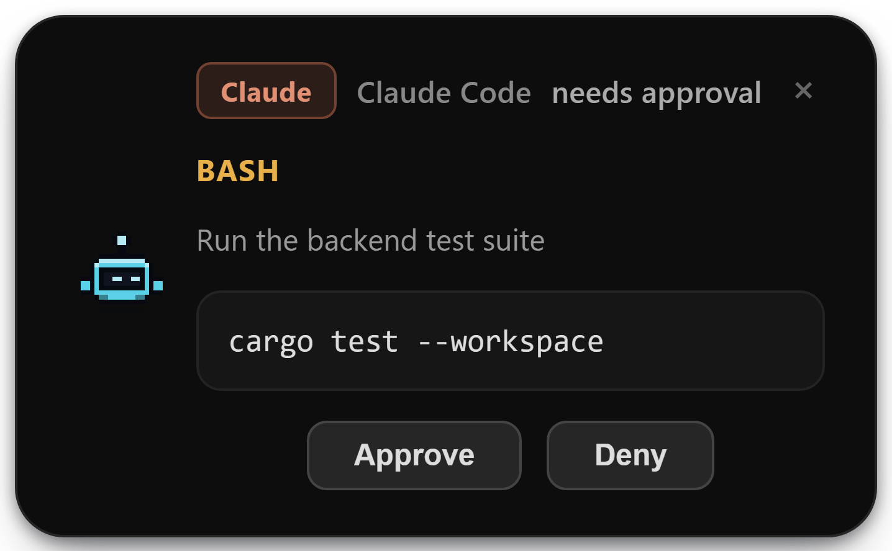

> **Status:** used daily by its author on one machine. Windows only for now.
> Interfaces are not stable yet.

---

## What it does

### Answers Claude Code for you

Claude Code asks permission before it runs a command or edits a file. Normally
that prompt waits in whichever terminal you started it in. Pixy puts it on top of
everything instead, so you can approve from wherever you are — and the answer
goes straight back to Claude.

The real command, file path and diff are on the card. Several sessions can be
waiting at once; they stack. When Claude asks a multiple-choice question, it
becomes tappable chips.

<table>
  <tr>
    <td align="center">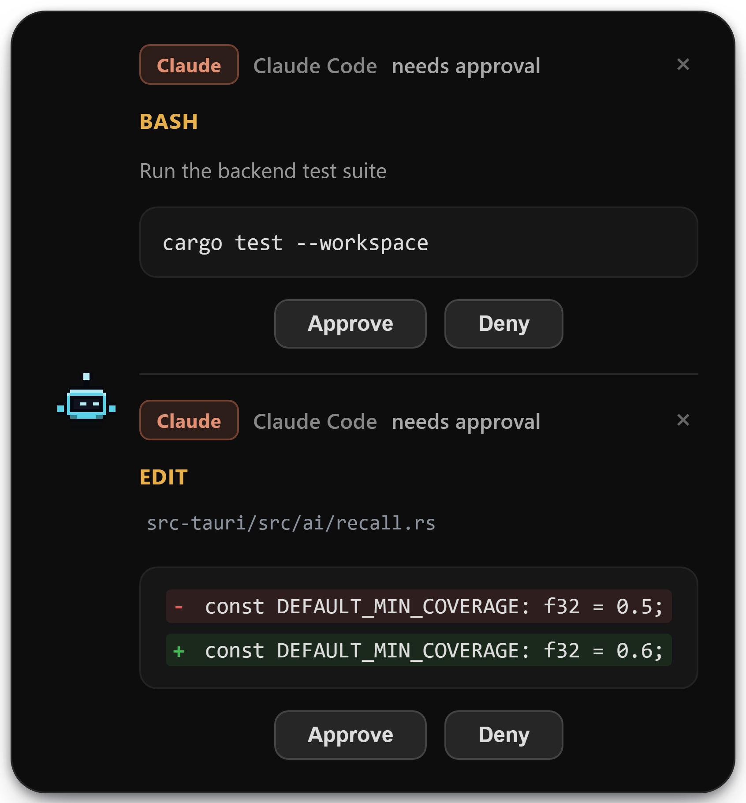 An edit, with the diff it is about to make</td>
    <td align="center">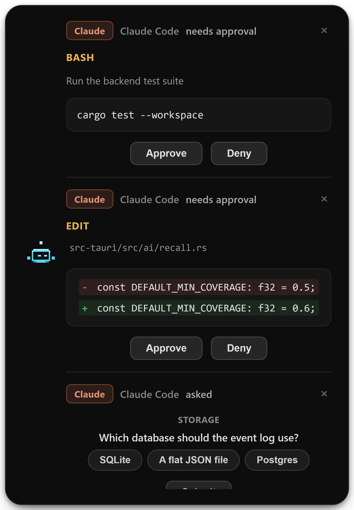 A question, as chips</td>
  </tr>
</table>

### Chats with a model on your own machine

Point it at whatever you run locally. Streaming replies, syntax highlighting,
several named models you can switch between mid-thought. Attach documents
(`pdf` `docx` `pptx` `xlsx` `csv` `md` `txt` `json` `html`) or images. Edit a
message and send it again, or retry a single reply.

  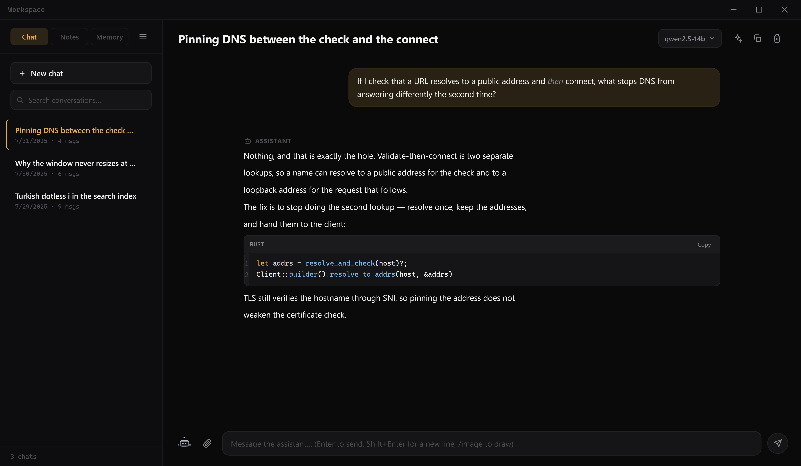

### Remembers what you already discussed

Ask "what did we decide about caching?" and it finds the conversation that said
*cache* — searched across everything you have ever talked about, and quietly
added to your new question. Add an embedding server and it will also find the one
that made the same point in different words.

### Tells you what happened while you were working

Unread mail with a one-line summary written by your local model. A morning brief.
A nudge before a meeting. Merged pull requests, failing CI, and issues that just
landed on you. All as notices that appear and go away — not another tab to check.

<table>
  <tr>
    <td align="center">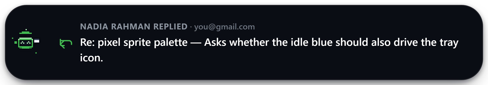 Summarised locally — not the first line of the mail</td>
    <td align="center">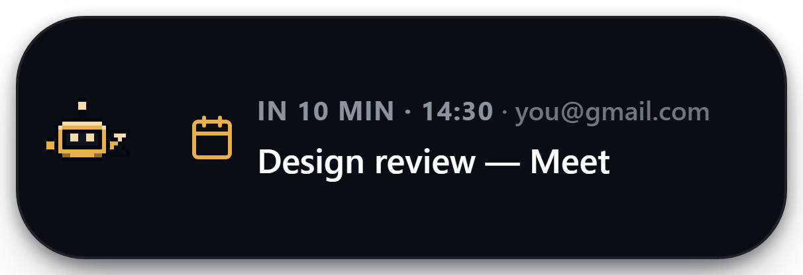 Before a meeting starts</td>
    <td align="center">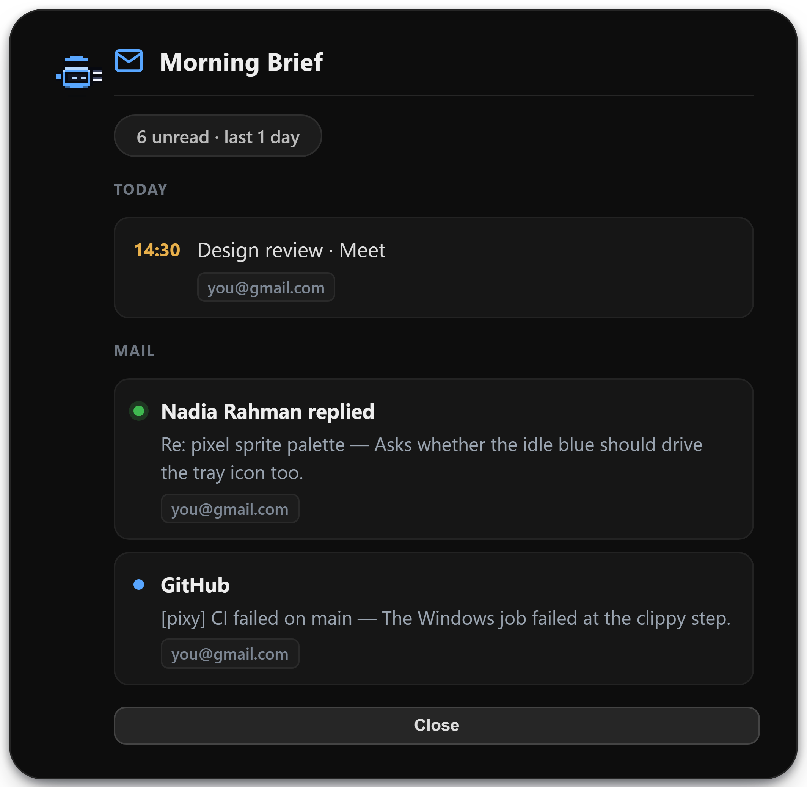 The morning brief</td>
  </tr>
  <tr>
    <td align="center">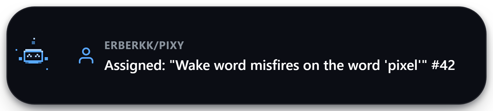 Something landed on you</td>
    <td colspan="2" align="center">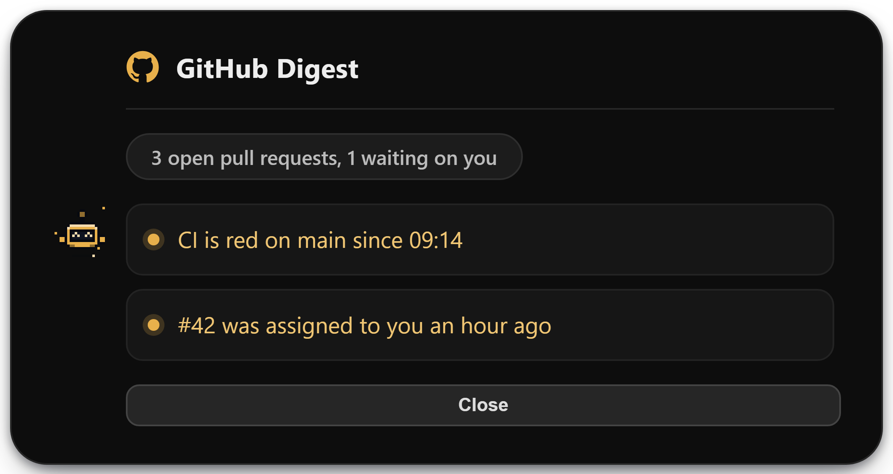 The daily digest</td>
  </tr>
</table>

### Listens when you say "hey pixy"

An on-device wake word, then transcription and speech through local servers.
Nothing is recorded or sent anywhere before the wake word fires.

### Draws pictures, keeps notes, plays music

Text-to-image through a local server, started when you ask and shut down when you
stop. A markdown notes pane with wiki-links, pinning and a focus mode — real
files in a real folder, editable by anything. A graph of what Claude Code chose
to remember about your projects. Music controls, per-app volume, and enough
awareness of whether you're on a call or away to stay out of the way.

<table>
  <tr>
    <td align="center">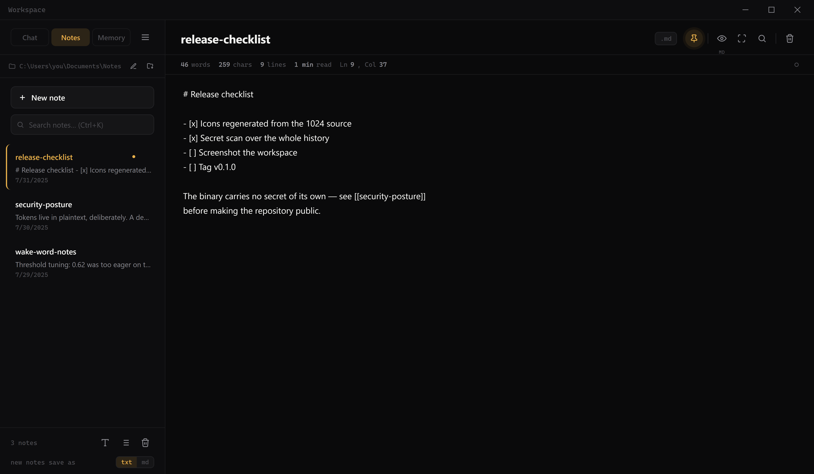 Notes</td>
    <td align="center">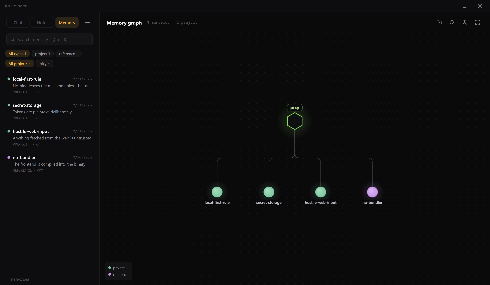 Memory</td>
  </tr>
</table>

---

## Using it

Pixy is a small pill that floats above your other windows. It changes shape and
colour with what it is doing:

  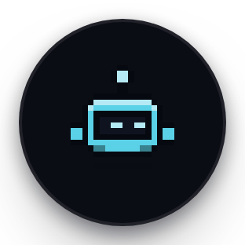
  &nbsp;
  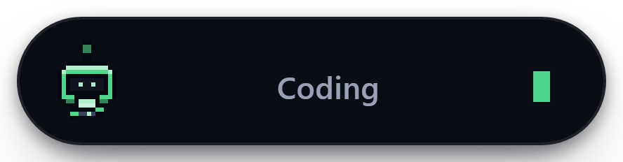
  &nbsp;
  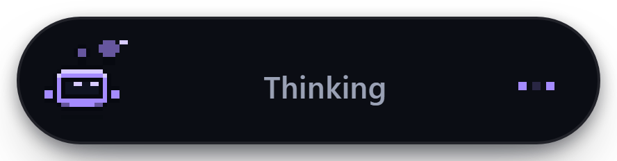
   
  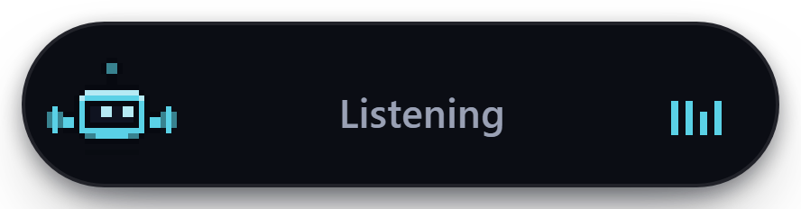
  &nbsp;
  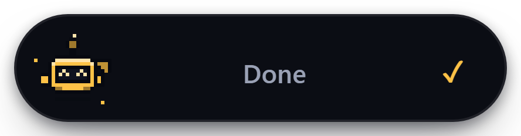
  &nbsp;
  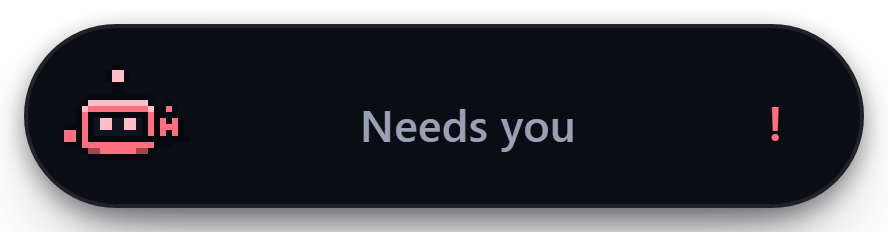

| Gesture | What happens |
|---|---|
| **Drag** | Move it anywhere on screen |
| **Single click** | Opens the music panel |
| **Double click** | Opens a terminal |
| **Right click** | Quick menu: **Workspace**, **Settings**, **Hide** |
| **Esc** | Closes the quick menu |

Clicks pass straight through to whatever is underneath unless the cursor is
actually on Pixy, so it can sit on top of your editor without getting in the way.

<table>
  <tr>
    <td align="center">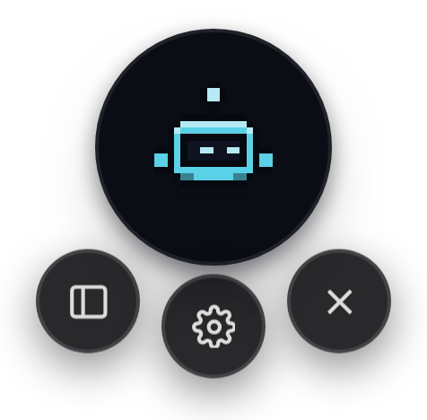 Right click</td>
    <td align="center">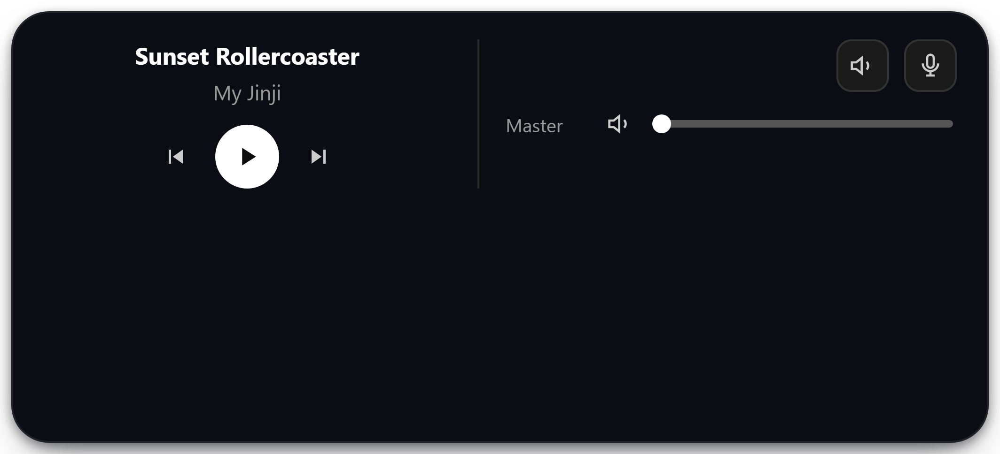 Single click</td>
  </tr>
</table>

**When a card appears:** press **Approve** or **Deny** and the answer goes back to
Claude Code. **×** dismisses it, which counts as a deny. Chips plus **Submit** for
a question. Anything else — mail, meetings, GitHub — you can click through to open.

**The tray icon** has everything the mascot can't reach: show and hide, open the
workspace or settings, open a terminal, run the GitHub digest or morning brief on
the spot, and quit.

---

## Getting started

**1. Install it.** Download the installer from
[Releases](../../releases) and run it. Windows will warn you that it's unsigned —
choose *More info* → *Run anyway*. It needs Windows 10 or 11.

**2. Open Settings** from the tray icon and fill in whatever you want to use.
Nothing needs to be set up in a particular order, and Pixy starts fine with none
of it — every feature simply stays quiet until it's configured.

**3. For the Claude Code cards,** paste a few lines of hook configuration into
`.claude/settings.json`. This is the one step that can't be done from the
Settings window.

**→ [SETUP.md](SETUP.md) walks through all of it**, one feature at a time: the
local model, the hooks, voice, pictures, Gmail and Calendar, GitHub, and what to
check when something doesn't work.

Prefer to build it yourself? See [CONTRIBUTING.md](CONTRIBUTING.md).

---

## Local by default

Pixy reads web pages a language model chose, runs a local HTTP server, and holds
OAuth tokens. That deserves a straight answer rather than a reassurance, so it has
its own document: **[SECURITY.md](SECURITY.md)**.

The short version:

- Chat history, notes, memory and the search index **never leave the machine**.
  Remembered history isn't sent to a hosted model unless you turn that on.
- You supply **your own OAuth client and tokens**. There is no shared application
  and no secret compiled into the binary — a desktop app can't keep one.
- Secrets are stored **in plaintext** on your machine. A deliberate trade-off for
  a local-first tool, explained rather than hidden.
- Web content is treated as **hostile input**.

---

## Where to go next

| | |
|---|---|
| **[SETUP.md](SETUP.md)** | How to use it — every feature, step by step |
| **[SECURITY.md](SECURITY.md)** | What it trusts, what it stores, how to report a vulnerability |
| **[CONTRIBUTING.md](CONTRIBUTING.md)** | Building it, where the code lives, filing an issue |
| **[docs/DESIGN-NOTES.md](docs/DESIGN-NOTES.md)** | Why it is built the way it is |

Built with [Tauri 2](https://tauri.app). Windows only today — porting is about
four files, and the notes are in CONTRIBUTING.

## License

MIT — see [LICENSE](LICENSE). Third-party components redistributed here are
listed in [THIRD-PARTY-NOTICES.md](THIRD-PARTY-NOTICES.md).
